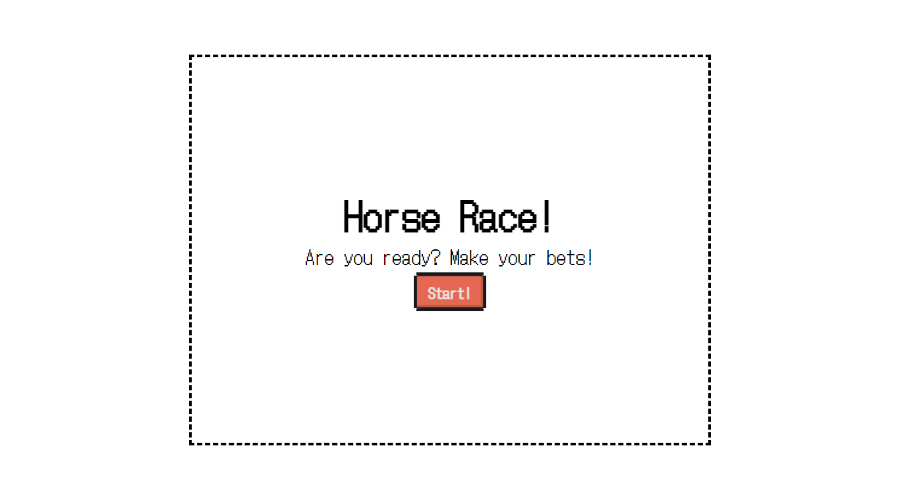

# 🐎 Horse Race - Make your bets!

Horse Race is a application to make digital bets with digital money in a digital device!

<p align="center">
  
</p>

## Assets

* Horse Gif: [Link](https://boingboing.net/2014/05/23/coder-needed-to-make-8-bit-zar.html)

## 🏃 Getting Started

First, clone this respository and access the created folder:

```bash
# Cloning repository
git clone https://github.com/iamtheluiz/horse-race.git

cd horse-race/
```

Getting into the folder, install project dependencies:

```bash
npm install
# or
yarn install
```

## 👨🏽‍💻 Usage

```bash
yarn run start
```

## ⚙️ Build

To build this project, run:

```bash
yarn build
```

## 💼 Authors

* **Luiz Gustavo** - *Development* - [iamtheluiz](https://github.com/iamtheluiz)

## 📃 License

See the [LICENSE](LICENSE) file for details.
